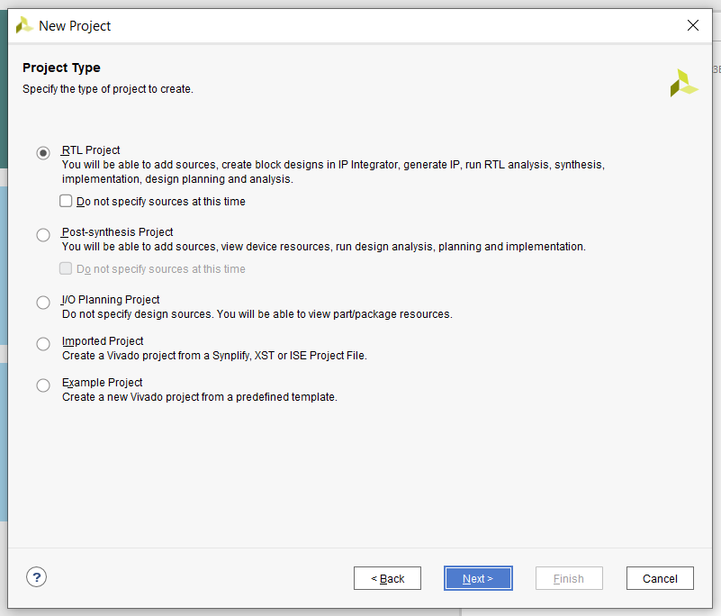
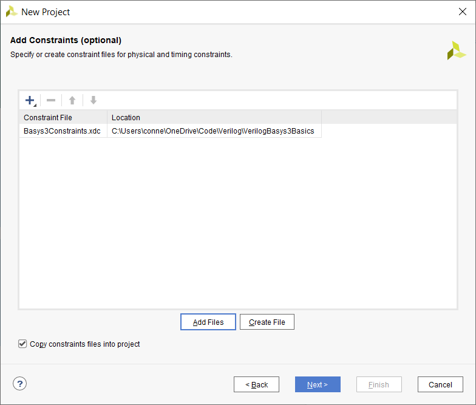
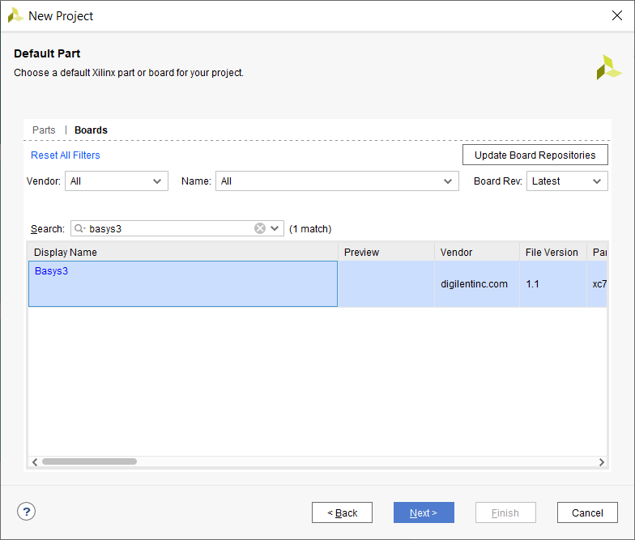
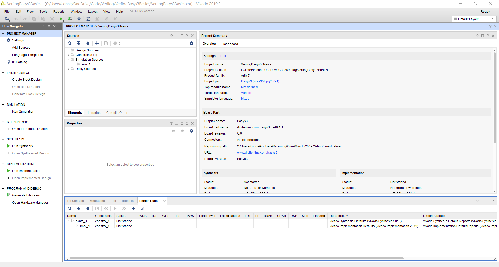
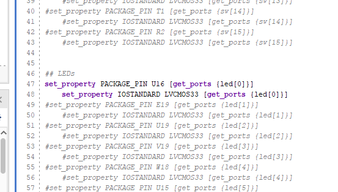
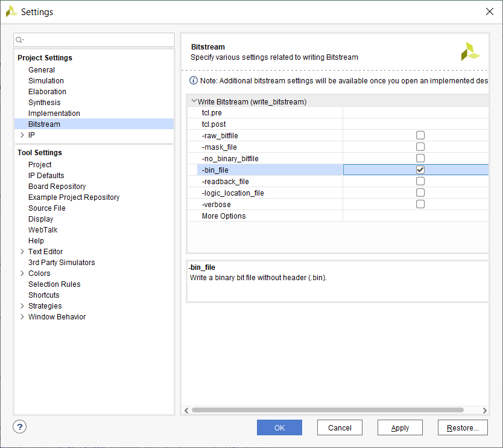
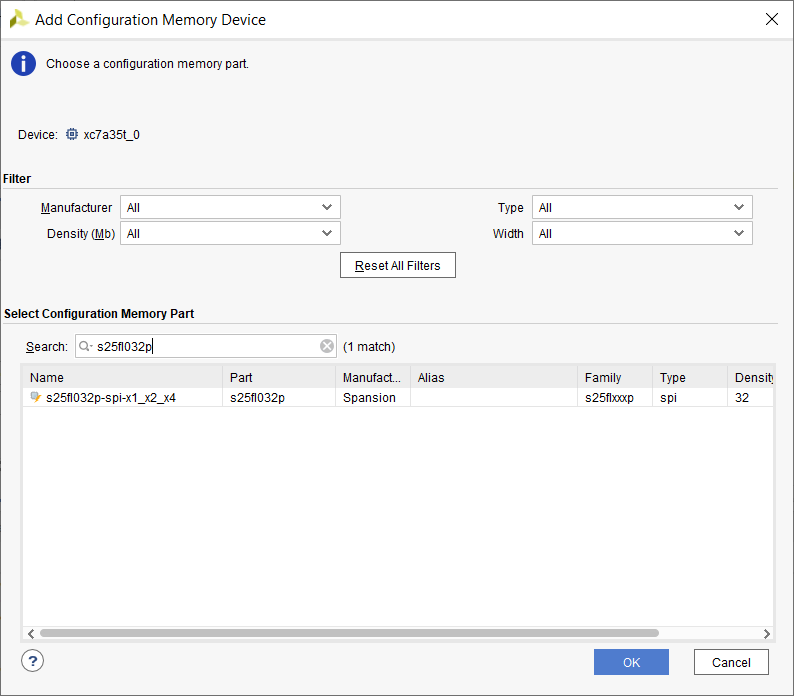

# VerilogBasys3Basics





Download latest board tools







```
## LEDs
set_property PACKAGE_PIN U16 [get_ports {led[0]}]					
	set_property IOSTANDARD LVCMOS33 [get_ports {led[0]}]
```
 

```
module led(
    output[0:0] led
    );
    
    assign led[0] = 1'b1;
    
endmodule
```

do not do

a bus is not an array
```
module led(
    output led [0:0]
    );
    
    assign led[0] = 1'b1;
    
endmodule
```

```
Run Synthesis > Run Implementation > Generate Bitstream
```

```
Open Target > Auto Connect > Program Device > led.bit
```

Temporary Program, will reset after power cycle. Program Configuration Memory Device to make it permanent. The original program is Basys3.stp.

https://sites.google.com/a/umn.edu/mxp-fpga/home/vivado-notes/programming-the-basys3-board-through-vivado


re-generate bitstream


s25fl032p



